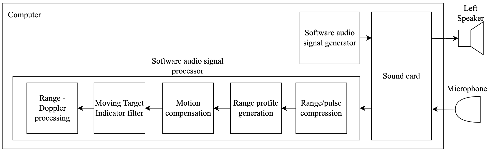

# audio-based-isar-imaging

## Introduction

This repository contains the source code for an investigation I performed into the design and evaluation of an audio-based inverse synthetic aperture radar (ISAR) imaging system. The work was inspired by previous work done in [1], [2], [3] and [4]. The experiment also considered the effects of ISAR image using a small integration angle vs a wide angle integration angle.

### Sonar system design

Sonar system block diagram

### Experiment setup

### Results

